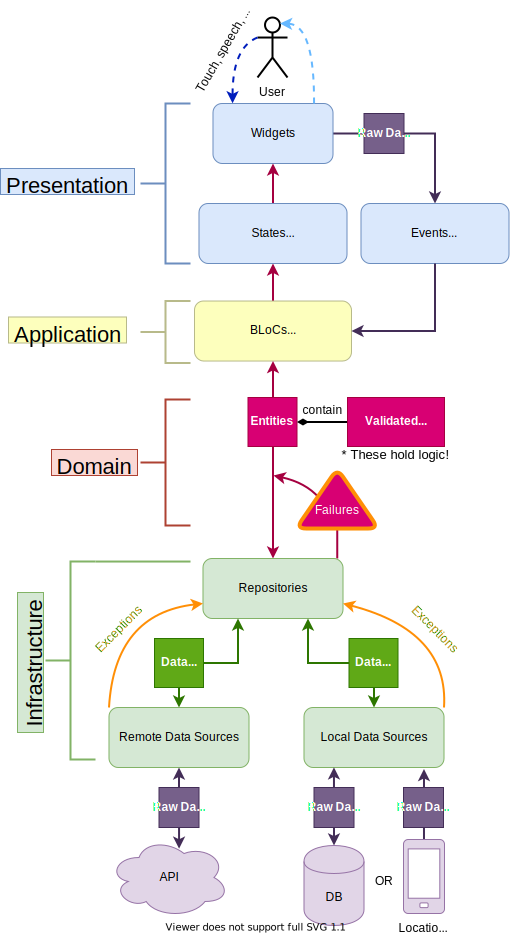

# Domain-Driven Design was applied
### Installation
1. `flutter clean`
2. `flutter pub get`
3. `flutter gen-l10n`
4. `flutter pub run build_runner build --delete-conflicting-outputs`

 

<h3 align="center">Created base on DDD Architecture (ResoCoder)</h3>

 

 
 

# rayzen
# rayza
# Restoran-Employee-App
